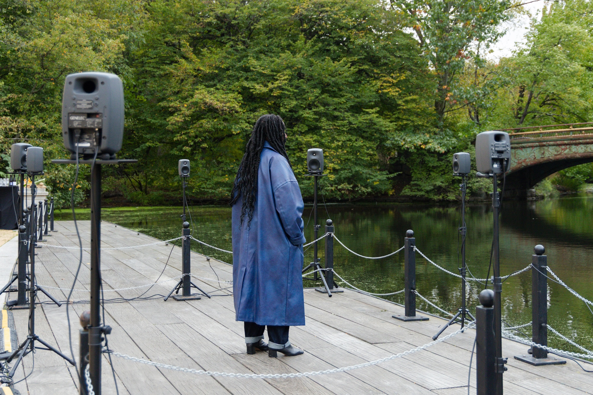
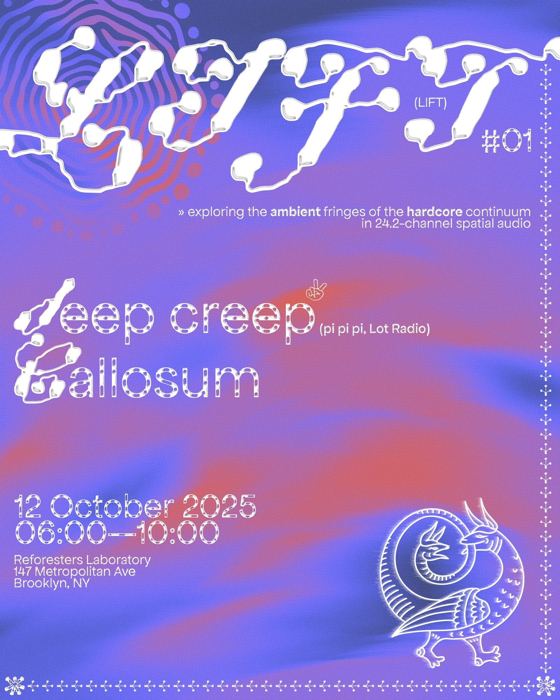
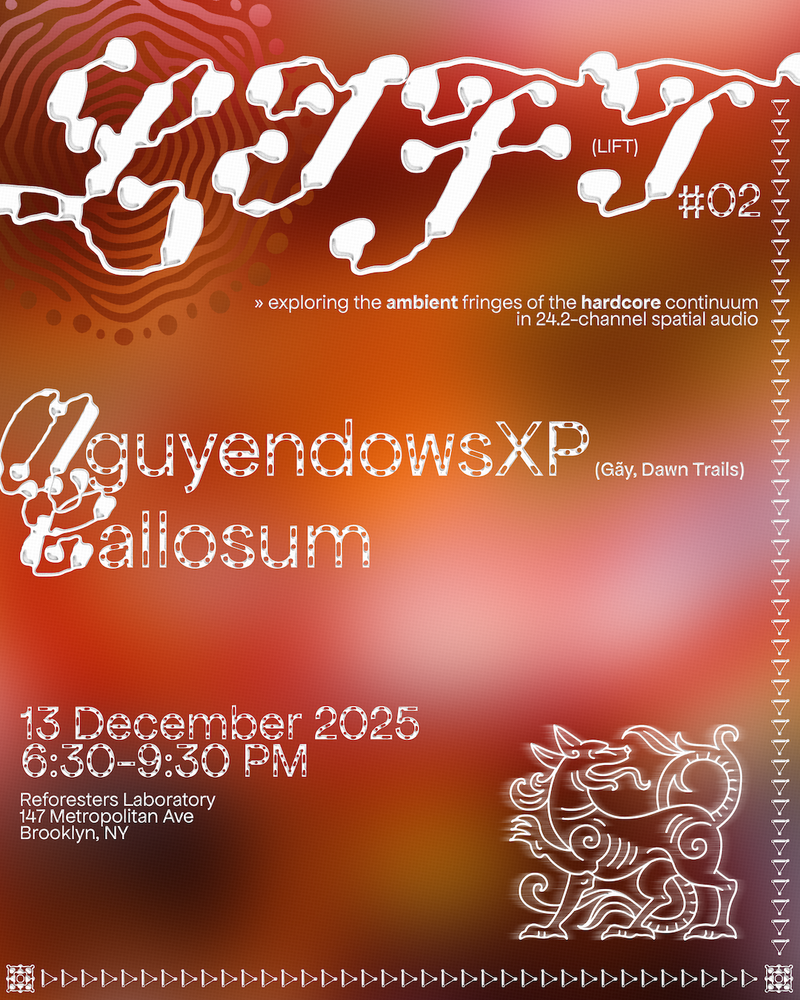
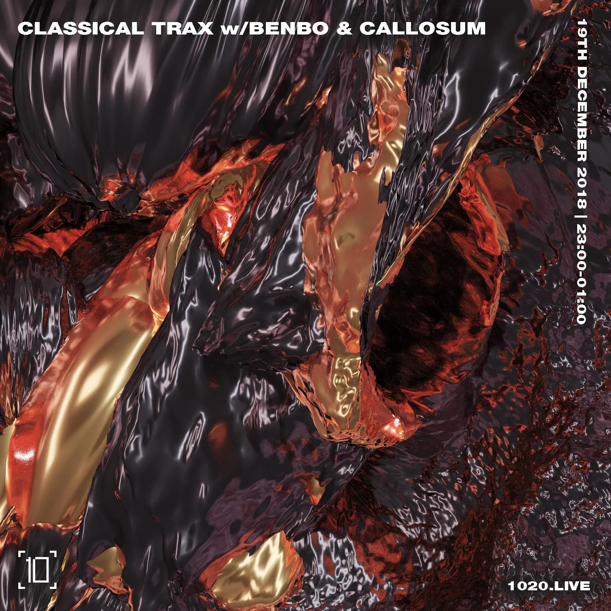
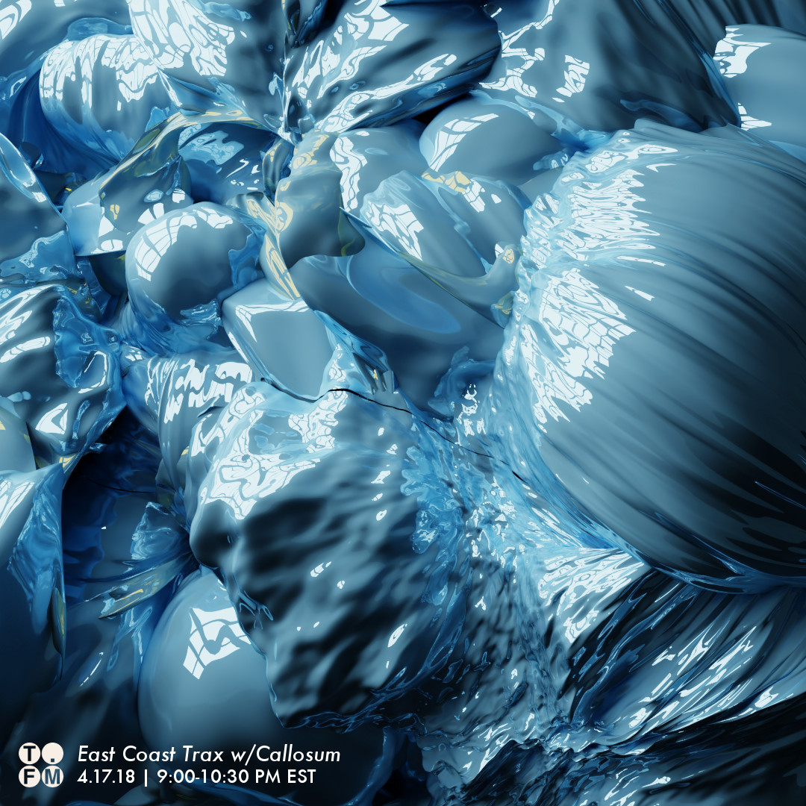
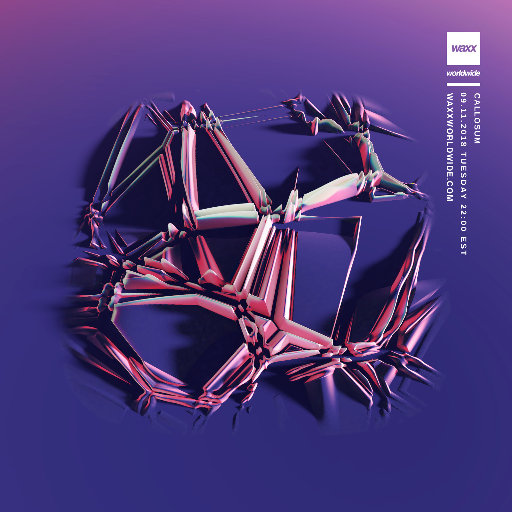

# Art

## Sound Art

### *Alaka'i 1777* (Installation/Performance, 2025)

<small>(Credit: Isaiah Winters, 2025)</small>

*Alaka'i 1777* is an immersive sound installation that reconstructs the lost song culture of the Kauaʻi ʻōʻō (kuh-wai-ee oh-oh), an extinct Hawaiian bird, by weaving together archival recordings with interacting artificial agents. 1777 is the last year that the Alaka'i swamp, the Kauaʻi ʻōʻō's ancestral habitat, was unaffected by European contact. Using a mathematical model of the avian vocal organ (the syrinx), trained on the few surviving recordings of the species, the work generates imagined songs—speculative echoes of what the Kauaʻi ʻōʻō's vocal repertoire may have been before population decline erased its complexity. As species dwindle, their songs, like human languages, become simpler and less varied, fading with each generation. To give listeners a deeper sense of this lost world, the entire soundscape is slowed down, allowing them to experience the songs as the original inhabitants of Alaka'i may have perceived them. Within this expanded space, artificial agents act as spectral ancestors, engaging in a dynamic, multi-layered dialogue with real Kauaʻi ʻōʻō recordings, offering a glimpse into a richer, more intricate soundscape that vanished long before the last bird fell silent.

Performances:

* [Reforesters Laboratory](https://reforesters.io/), 24.2-channel audio (Brooklyn, June 21-22, 2025)
* [TechnoMirage](https://www.uaad.art/technomirage), 8-channel audio (Manhattan, September 21, 2025)
* [NEW INC](https://www.newmuseum.org/new-inc/) and the [New Museum](https://www.newmuseum.org/)'s Creative Science Dinner at the [Prospect Park Boathouse](https://www.prospectpark.org/visit-the-park/weddings-and-special-events/boathouse/), 8-channel audio (Brooklyn, October 14, 2025)
* 25 Saint James Place, 8-channel audio (Manhattan, November 20, 2025)
* [Something Fierce Festival](https://www.ameliamarzec.com/somethingfierce/) at [Flux Factory](https://www.fluxfactory.org/), 8-channel audio (Queens, November 22-23, 2025)
* [Technology in Music and Related Art](https://www.oberlin.edu/timara) at [Oberlin College](https://www.oberlin.edu/), multi-channel audio (Ohio, December 5, 2025)
* [UPCOMING] [Ortega y Gasset Projects](https://www.oygprojects.com/), 8-channel audio (Brooklyn, TBD 2026)
* [UPCOMING] [New Ear](https://new-ear.org/), 8-channel audio (Manhattan, TBD 2026)

*Made possible by the [Cultural Evolution Society](https://culturalevolutionsociety.org/), the [Diverse Intelligences Summer Institute](https://disi.org/), [Cornell's Macaulay Library](https://www.macaulaylibrary.org/), and [NEW INC](https://www.newmuseum.org/new-inc/).*

### *Deep Listening for Nonhuman Perspective-Taking* (Workshop, 2024)

*Deep Listening for Nonhuman Perspective-Taking* is a participatory, immersive sound workshop where we listen deeply to diverse sounds of nonhuman life—infrasonic booms of whales, drumming displays of spiders, and complex songs of endangered and extinct birds. Every species experiences the world through its own umwelt, a distinct sensory reality that shapes how they communicate and express themselves. We explore each soundscape together, first hearing it as we do, then as the animals themselves might. I provide key context for each species—how they perceive the world, why they communicate—and invite participants to adopt their umwelt while listening to them communicate. As species disappear, so do their voices and cultures. Together, we reflect on this loss and what it means to empathize with the more-than-human world in an age of mass extinction.

Workshops:

* [University of St. Andrews](https://www.st-andrews.ac.uk/) (Scotland, July 10, 2024)
* [Hex House](https://hexhouse.studio/) (Brooklyn, December 7, 2024)
* [The Bakery](https://www.instagram.com/bake_some_bread/) (Brooklyn, March 29, 2025)
* Rutgers Art Network at [Rutgers University](https://www.rutgers.edu/) (New Jersey, October 29, 2025)
* 25 Saint James Place, 8-channel audio (Manhattan, November 20, 2025)

*Made possible by the [Diverse Intelligences Summer Institute](https://disi.org/).*

## Visual Art

Below is a small sample of the visual art I have made since 2016, mostly for event promo. My other works are on my [Instagram](https://www.instagram.com/callosummusic/) and available for sale as NFTs in [my OpenSea collection](https://opensea.io/collection/callosum-3d-works).

{style="width: 49%;"} {style="width: 49%;"}

{style="width: 32%;"} {style="width: 32%;"} {style="width: 32%;"}

  
