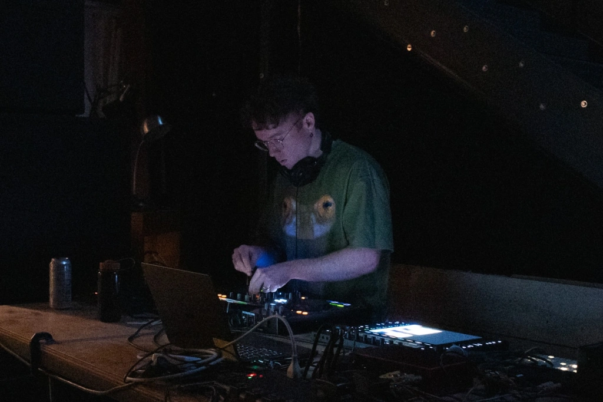

# Music

<small>(Credit: Rachel Amico, 2025)</small>

Since 2014, I have been producing and releasing experimental club music as Callosum. As a DJ, I've held residencies on NYC-based radio stations like [Half Moon Radio](https://www.mixcloud.com/HalfMoonbk/) and [Transit FM](https://www.mixcloud.com/Transit_FM/), done guest mixes for international radio stations and platforms like [Rinse FM](https://soundcloud.com/rinsefm/classicaltrax310318), [NTS Radio](https://www.nts.live/shows/classical-trax/episodes/classical-trax-29th-june-2016), [The Lot Radio](https://soundcloud.com/thelotradio/club-ettiquite-w-guests-callosum-and-raverjinn-the-lot-radio-02-28-2020), [Rinse France](https://www.mixcloud.com/RinseFrance/resources-invite-callosum-11-octobre-2016/), [Radar Radio](https://www.mixcloud.com/RadarRadioLDN/callosum-2nd-june-2015/), and [Currents FM](https://soundcloud.com/callosum-1/pressure-plate-common-multiverse-initiative-march-17-2021), and served as the music director for [WUSC FM](https://wusc.sc.edu/) (2014-2015). My most recent residency, on [Callshop Radio](https://callshopradio.com/) in Leipzig, focused on exploring the historical roots of emotion and drama in contemporary club and rave music. I also have production credit on the album [$uccessor](https://en.wikipedia.org/wiki/Successor_(album)) by Dedekind Cut, alongside artists like DJ Shadow, Serpentwithfeet, and Claude Speeed. You can check out my music on [Spotify](https://open.spotify.com/artist/1B1hXeIH0DzfHlQr5eoNCO), [Apple Music](https://music.apple.com/us/artist/callosum/682703870), or via the streaming links below.

Starting in fall 2025, I'll be hosting an event series called LIFT at the Reforesters Laboratory in Brooklyn—"exploring the ambient fringes of the hardcore continuum in 24.2-channel spatial audio". [Follow on Instagram](https://www.instagram.com/lift.mp3/) for updates!

## Recent Releases

<iframe style="border: 0; width: 100%; height: 120px;" src="https://bandcamp.com/EmbeddedPlayer/album=1455066173/size=large/bgcol=ffffff/linkcol=0687f5/tracklist=false/artwork=small/transparent=true/" seamless><a href="https://48ksps.bandcamp.com/album/tell-you">Tell You by Callosum</a></iframe>

<iframe style="border: 0; width: 100%; height: 120px;" src="https://bandcamp.com/EmbeddedPlayer/album=948706999/size=large/bgcol=ffffff/linkcol=0687f5/tracklist=false/artwork=small/transparent=true/" seamless><a href="https://48ksps.bandcamp.com/album/meadow-cycles">Meadow Cycles by Callosum</a></iframe>

<iframe style="border: 0; width: 100%; height: 120px;" src="https://bandcamp.com/EmbeddedPlayer/album=1749481757/size=large/bgcol=ffffff/linkcol=0687f5/tracklist=false/artwork=small/transparent=true/" seamless><a href="https://callosum.bandcamp.com/album/2019-unfinished-edits">2019 Unfinished + Edits by Callosum</a></iframe>

<iframe style="border: 0; width: 100%; height: 120px;" src="https://bandcamp.com/EmbeddedPlayer/album=2037061039/size=large/bgcol=ffffff/linkcol=0687f5/tracklist=false/artwork=small/transparent=true/" seamless><a href="https://lovelessrecords.bandcamp.com/album/materia06-moonwake">[MATERIA06] Moonwake by Callosum</a></iframe>

<iframe style="border: 0; width: 100%; height: 120px;" src="https://bandcamp.com/EmbeddedPlayer/album=2816986759/size=large/bgcol=ffffff/linkcol=0687f5/tracklist=false/artwork=small/transparent=true/" seamless><a href="https://nostrohoodsystem.bandcamp.com/album/tenaya">Tenaya by Callosum</a></iframe>

## Recent Mixes

<iframe width="100%" height="450" scrolling="no" frameborder="no" allow="autoplay" src="https://w.soundcloud.com/player/?url=https%3A//api.soundcloud.com/playlists/soundcloud%253Aplaylists%253A1912940799&color=%230b0a07&auto_play=false&hide_related=false&show_comments=true&show_user=true&show_reposts=false&show_teaser=true"></iframe>
<a href="https://soundcloud.com/callosum-1" title="Callosum" target="_blank" style="color: #cccccc; text-decoration: none;">Callosum</a> · <a href="https://soundcloud.com/callosum-1/sets/recent-mixes" title="Recent Mixes" target="_blank" style="color: #cccccc; text-decoration: none;">Recent Mixes</a>

## Callshop Radio Residency

<iframe width="100%" height="450" scrolling="no" frameborder="no" allow="autoplay" src="https://w.soundcloud.com/player/?url=https%3A//api.soundcloud.com/playlists/soundcloud%253Aplaylists%253A1323792037&color=%230b0a07&auto_play=false&hide_related=false&show_comments=true&show_user=true&show_reposts=false&show_teaser=true"></iframe>
<a href="https://soundcloud.com/callosum-1" title="Callosum" target="_blank" style="color: #cccccc; text-decoration: none;">Callosum</a> · <a href="https://soundcloud.com/callosum-1/sets/ecstatic-origins" title="Ecstatic Origins (Callshop Radio Residency)" target="_blank" style="color: #cccccc; text-decoration: none;">Ecstatic Origins (Callshop Radio Residency)</a>

  
