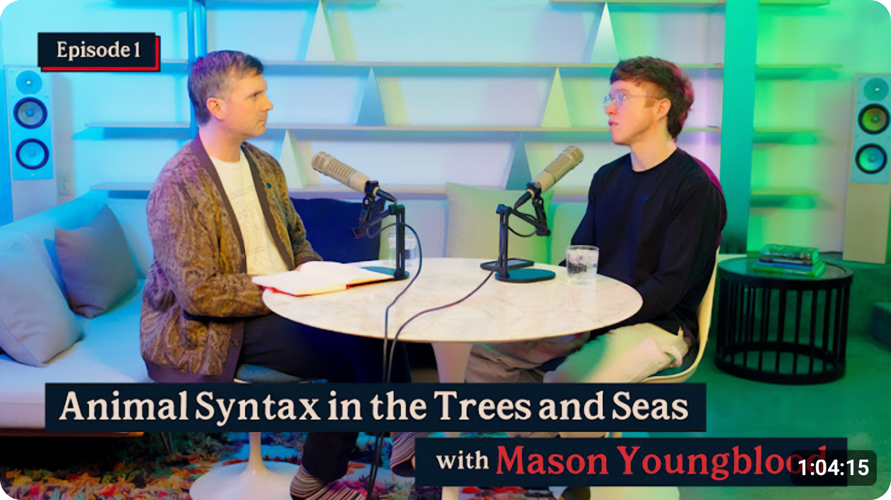
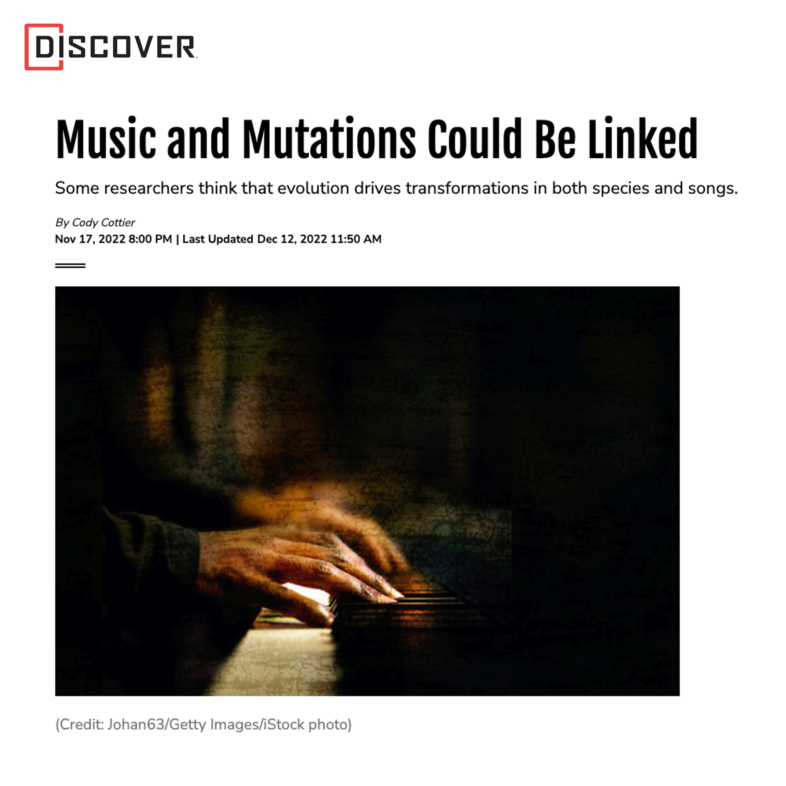

# Press

## Recent Highlights

- 
- 
- 
- 

Below is an expanded selection of press that covers, cites, or discusses my research.

## Press Coverage

--8<-- "docs/resources/press/full_press_list.md"

  
